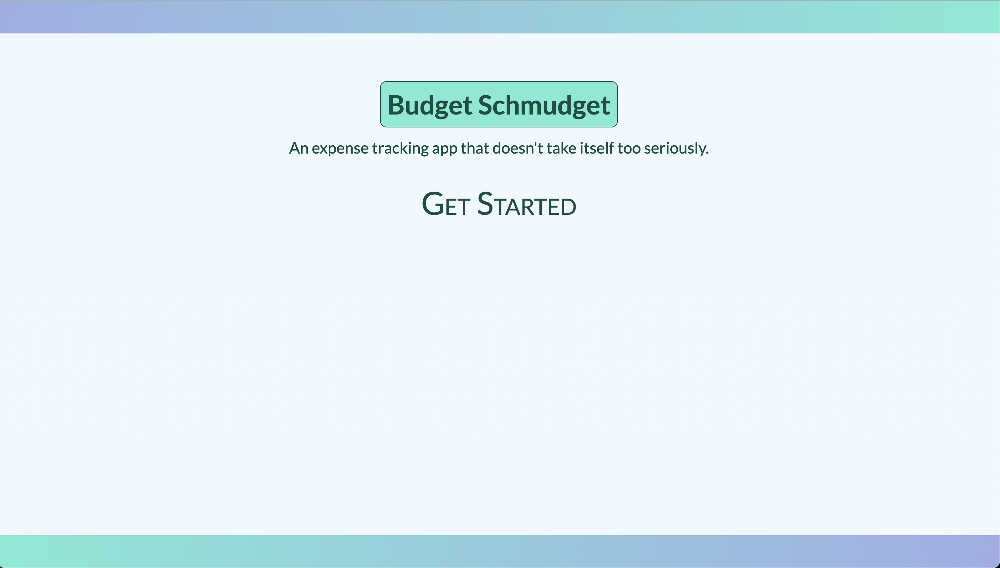
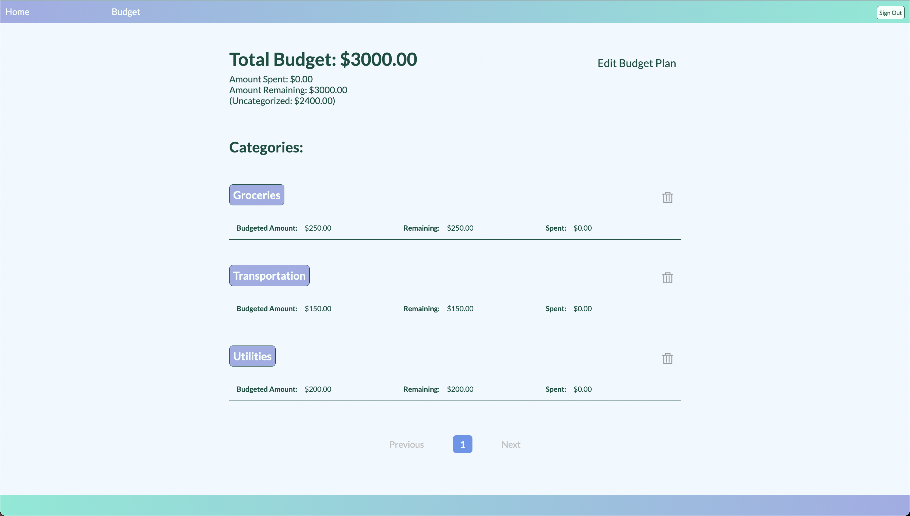
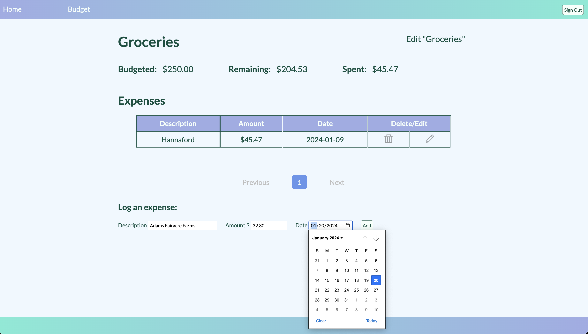

# "Budget Schmudget"

## Specifications

This project was developed using:

- Ruby v. 3.1.2
- Bundler v. 2.3.24
- PostgreSQL 14.5 (Homebrew)

## Setup

To set up the project:

1. Enter the directory called "budget_app" and run `bundle install`
2. Ensure PostgreSQL in installed and available for connection
3. Build the schema by running: `psql -d [my_database] < schema.sql`

## Running the app

After running `bundle install`, to start the app run `ruby budget.rb` from the command line. (If this gives you problems, try `bundle exec ruby budget.rb`.)

From your browser (Chrome recommended), navigate to `localhost:4567`. 

### Username and Password

Click "Get Started". The login credentials are:

- username: **HRM**
- password: **SweetDeetEmpire**

(Support for multiple users in the works. 😉)

You can sign out at any time with the "Sign Out" button at the top right of any page other than the home page. Navigating to any other page while signed out should require authentication first, and on successful authentication should then reroute you to the page you requested.

### Setting up a budget

To begin, enter a desire budget total. This is the last time you'll see the setup page, but you can edit your total later on.

Once you add categories, they will appear on the `"/budget"` page:

 To view, edit, and log expenses to a category you can click on its name.

 

## Project Reflections

My main objectives for this project were:

- Create a classic CRUD app following best practices
- Separation of concerns between app and database logic
- Multiple page views
- Get comfy with PostgreSQL
- Try my hand at styling with HTML/CSS from scratch

### Note about the database

The schema file creates an extra database table called `budgets`, and the app currently only uses one row of this table.

The app is hardcoded for that row to have an `id` value of 1. This should happen automatically, as long as the sequence `budget_id_seq` isn't altered before starting the application. If there are any issues, it might be worth checking to make sure that the command `SELECT * FROM budgets` returns a single row where the value of the `id` column is 1.

(The`budgets` table exists to lay the groundwork for further work on the project that will allow for multiple budgets per user.)

### Other reflections

- In an effort to avoid N + 1 queries, I pushed more application logic to the database than I originally intended.

- This was one of my first times tackling pagination. I wasn't sure whether it would be better to load all the items in `budget.rb` and handle pagination there, or to do so with a database query. In the end I did it with the database. With scaling in mind, this might need to be handled differently, but that was out of scope for the project.
